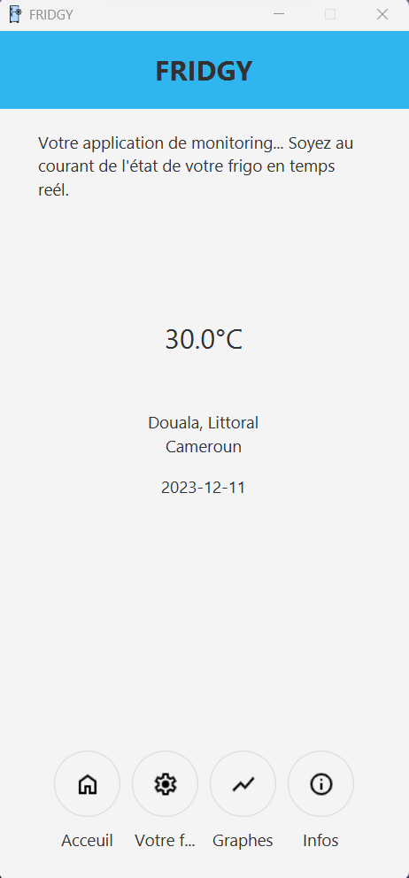
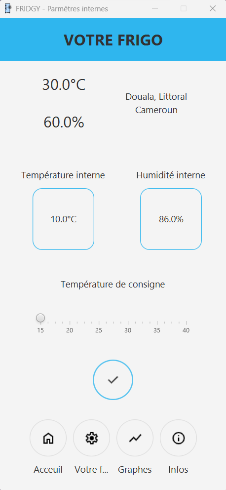
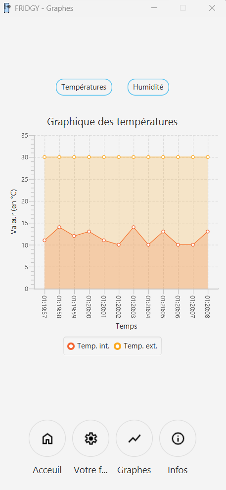
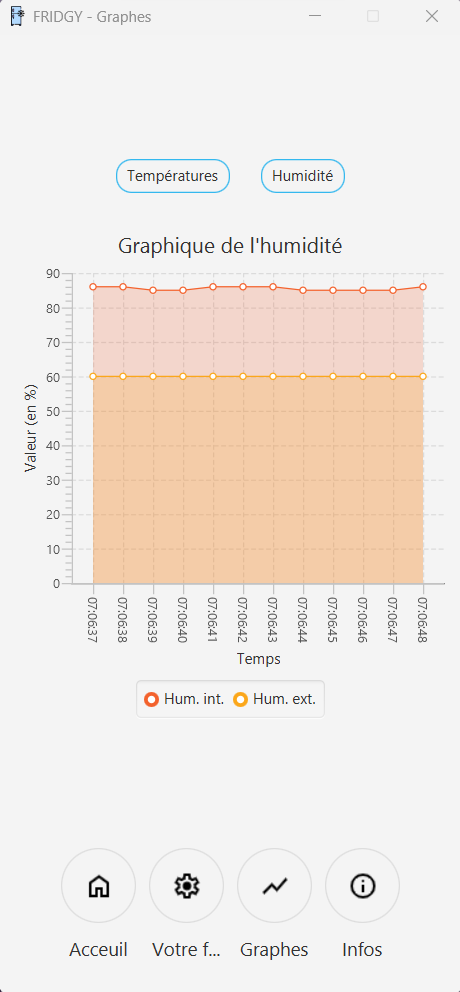
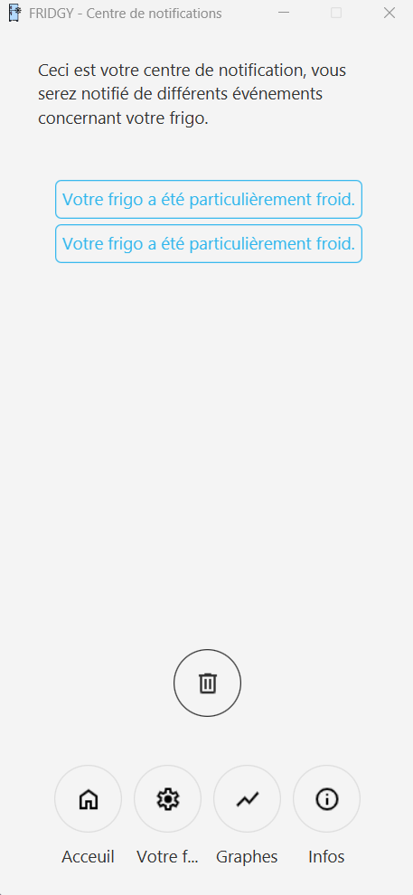

<p align="center">
  
</p>
<h1 align="center"></br>Pimp My Fridge</h1>
<h2 align="center"></br>Groupe 7 X2027</h2>
<p align="center">
    Java maven arduino thermodynamic - five ucac-icam's students Project - semester 1 2023/2024.
</p>


---
## Overview
### Project goal
Pimp My Fridge is a 2nd year ucac-icam project which consists of creating an electronic cooling circuit for a mini USB fridge. 
all temperature monitoring and controls are carried out via a Java application under Maven worked with Javafx

### Repo Content
* **Pimp My Fridge:** The Maven Project with all the source code.
* **arduinoModule:** The code for the arduino card

---
## Get Started
Before all, ensure you have an arduino card which provides datas under Json object format.
1. Clone the repo:
    ```sh
    git clone https://github.com/Francksean/PimpMyFridge
    ```
2. Go to the main.Main class or to the Main-1.0-SNAPSHOT.jar and run it
    ```sh
    cd ./PimpMyFridge/Main/Main or cd ./PimpMyFridge/Main/target/Main-1.0-SNAPSHOT.jar
    ```
3. Enjoy Fridgy !

---
## The Interface
Fridgy ! an user-friendly, real-time Java interface to control your fridge !

 
 



